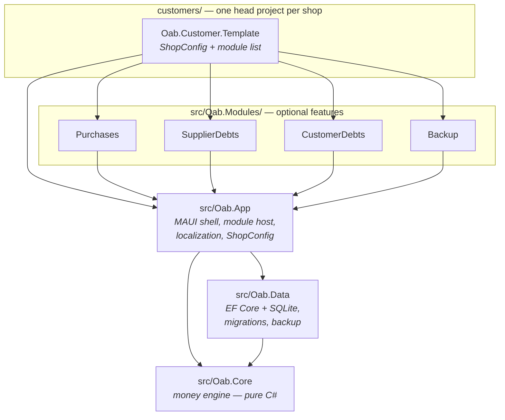

# 01 — Architecture

[← Documentation index](README.md) · Next: [02 — The Money Engine](02-money-engine.md)

---

## 1. The shape of the system

OAB is a **product line**, not an application. There is one repository, one
shared core, and one small composition project per shop. A "custom build" is a
~40-line `MauiProgram.cs` that names a `ShopConfig` and a list of modules.



Arrows are compile-time project references. Note what is **absent**: nothing
points downward into a module, `Oab.Core` references nothing, and `Oab.Data`
knows nothing about MAUI.

## 2. Project inventory

| Project | Target framework(s) | Depends on | Purpose |
|---|---|---|---|
| `src/Oab.Core` | `net10.0` | *(nothing)* | Domain entities, ledger math, `LedgerService`, money formatting, summary report |
| `src/Oab.Data` | `net10.0` | Core | `OabDbContext`, `LedgerStore`, EF migrations, backup/restore |
| `src/Oab.App` | `net10.0-android`, `net10.0-windows10.0.19041.0` | Core, Data | `OabApp`, `OabShell`, `IOabModule`, localization, `ShopConfig`, party statement page |
| `src/Oab.Modules/Oab.Modules.Purchases` | android, windows | App | Purchase log + new-purchase form |
| `src/Oab.Modules/Oab.Modules.SupplierDebts` | android, windows | App | Supplier list with balances and payments |
| `src/Oab.Modules/Oab.Modules.CustomerDebts` | android, windows | App | Customer list with debts and collections |
| `src/Oab.Modules/Oab.Modules.Backup` | android, windows | App | Snapshot / readable summary / restore |
| `customers/Oab.Customer.Template` | android, windows | App + all four modules | The app head to copy per shop |
| `tests/Oab.TestSupport` | `net10.0` | Core | Shared `InMemoryLedgerStore` |
| `tests/Oab.Core.Tests` | `net10.0` | Core, TestSupport | Ledger math and service (42 tests) |
| `tests/Oab.Data.Tests` | `net10.0` | Data | Real SQLite + migrations + backup (13 tests) |
| `tests/Oab.App.Tests` | `net10.0-windows10.0.19041.0` | App + all modules, TestSupport | View models (41 tests) |

Projects are listed in [`OAB.slnx`](../OAB.slnx), the XML solution format.

## 3. Dependency rules

These are enforced by project references, and each one exists for a reason.

| Rule | Why |
|---|---|
| `Oab.Core` references **no** packages | The money engine must be testable in milliseconds with no runtime, no database, no device. It is the one part that must never be wrong. |
| `Oab.Data` references Core, never MAUI | Storage is swappable and testable on a Linux CI box. |
| Modules reference `Oab.App`, never each other | A shop can take any subset of modules. A module that referenced another would break that. |
| `Oab.App` references **no** module | The shell hosts whatever it is handed. It has zero knowledge of Purchases, Suppliers, Customers, or Backup. |
| Only the customer head references modules | Which features a shop gets is a property of their csproj + `MauiProgram`, nothing else. |

The consequence worth internalising: **there is no place in `src/` where a
feature list is written down.** Search for "Purchases" in `Oab.App` and you find
nothing. The flyout menu is computed at runtime from the modules passed to
`UseOab`.

## 4. Startup sequence

Everything begins in the customer head's
[`MauiProgram.CreateMauiApp()`](../customers/Oab.Customer.Template/MauiProgram.cs).

```mermaid
sequenceDiagram
    participant MP as MauiProgram
    participant UO as UseOab (extension)
    participant DI as ServiceCollection
    participant App as OabApp
    participant Shell as OabShell

    MP->>UO: UseOab(shopConfig, modules...)
    UO->>DI: UseMauiApp&lt;OabApp&gt;()
    UO->>DI: AddSingleton(ShopConfig)
    UO->>DI: AddSingleton(LocalizationManager) — also sets LocalizationManager.Current
    UO->>DI: AddSingleton&lt;IMoneyFormatter, MoneyFormatter&gt;()
    UO->>DI: AddOabData(AppDataDirectory/oab.db)
    UO->>DI: AddSingleton&lt;IReadOnlyList&lt;IOabModule&gt;&gt;(modules)
    UO->>DI: AddSingleton&lt;OabShell&gt;()
    UO->>DI: AddTransient PartyStatementViewModel + Page
    loop each module
        UO->>DI: module.ConfigureServices(services)
        UO->>UO: module.RegisterRoutes()
        UO->>DI: AddTransient(navItem.PageType) for each nav item
    end
    MP->>App: builder.Build() → OabApp constructed
    App->>App: OabServices.Provider = services
    App->>App: db.Database.Migrate()
    App->>Shell: CreateWindow() resolves OabShell
    Shell->>Shell: build flyout from module nav items
```

Three things to notice:

1. **The schema is migrated in the `OabApp` constructor**, before any page can
   exist. Upgrades are therefore automatic and no screen ever sees a stale
   schema. ([`OabApp.cs`](../src/Oab.App/OabApp.cs))
2. **`OabServices.Provider` is set at the same moment**, which is what allows
   pages pushed from code-behind (`OabServices.Get<NewPurchasePage>()`) to
   resolve dependencies.
3. **Module order is menu order.** `UseOab(config, A, B, C)` produces a flyout
   in exactly that order.

## 5. Dependency-injection registry

Every service the app can resolve, and its lifetime.

| Service | Lifetime | Registered by | Notes |
|---|---|---|---|
| `ShopConfig` | Singleton | `UseOab` | The shop's whole configuration |
| `LocalizationManager` | Singleton | `UseOab` | Factory also assigns the static `Current` |
| `IMoneyFormatter` → `MoneyFormatter` | Singleton | `UseOab` | Binds `MoneyFormat` to config + culture |
| `IDbContextFactory<OabDbContext>` | Singleton (EF default) | `AddOabData` | Context-per-operation |
| `ILedgerStore` → `LedgerStore` | Singleton | `AddOabData` | Safe as a singleton *because* it uses the factory |
| `LedgerService` | Singleton | `AddOabData` | Stateless |
| `OabDatabase` (record of the .db path) | Singleton | `AddOabData` | Consumed by the backup service |
| `IDatabaseBackup` → `DatabaseBackupService` | Singleton | `AddOabData` | |
| `IReadOnlyList<IOabModule>` | Singleton | `UseOab` | The module list itself |
| `OabShell` | Singleton | `UseOab` | One shell for the app's life |
| `PartyStatementViewModel` / `PartyStatementPage` | Transient | `UseOab` | New page instance per push |
| Module pages named in nav items | Transient | `UseOab` loop | e.g. `PurchasesListPage` |
| Module view models & extra pages | Transient | each `IOabModule.ConfigureServices` | e.g. `NewPurchasePage` |

## 6. Navigation model

The app uses MAUI `Shell` with a flyout. There are two navigation mechanisms:

**Top-level (flyout items)** — one per `OabNavItem` returned by a module. The
shell wraps each in a `FlyoutItem` + `ShellContent`, whose `Title` is *bound*
(not set) to `LocalizationManager[titleKey]` so it re-renders when the language
changes. ([`OabShell.cs`](../src/Oab.App/OabShell.cs))

**Detail pages (pushed)** — code-behind resolves the page from
`OabServices` and calls `Navigation.PushAsync`. Two exist today:

| From | Trigger | To |
|---|---|---|
| Purchases list | `＋` button | `NewPurchasePage` |
| Suppliers list | tap a card | `PartyStatementPage` (perspective `Supplier`) |
| Customers list | tap a card | `PartyStatementPage` (perspective `Customer`) |

`IOabModule.RegisterRoutes()` exists for `Routing.RegisterRoute`-style
navigation but no module uses it yet — it has a default empty implementation.

## 7. Data flow

### Writing money

```
Page code-behind / XAML command
  → ViewModel method
    → LedgerService.RecordXxxAsync(...)        // decides which entries to append
      → LedgerMath.SignedAmount(kind, amount)  // the sign convention, in one place
      → ILedgerStore.AddEntriesAsync([...])    // append only
        → LedgerStore → new OabDbContext → SQLite INSERT
  → ViewModel.LoadAsync()                      // re-read; nothing is mutated in place
```

No view model ever constructs a `LedgerEntry`. That is the rule that keeps the
sign convention from leaking into UI code.

### Reading money

```
ViewModel.LoadAsync()
  → ILedgerStore.GetBalancesAsync() / GetEntriesForPartyAsync(...)
    → SELECT amounts → summed in C# (see 03 §5 for why not in SQL)
  → LedgerMath / IMoneyFormatter / LocalizationManager
  → immutable row records (SupplierRow, CustomerRow, PurchaseRow, StatementRow)
  → ObservableCollection → CollectionView
```

Row types are plain immutable classes with `required init` properties and
**pre-rendered text and colour**. There is not a single `IValueConverter` in the
codebase; formatting decisions are made in the view model where they can be
unit-tested. This is why `Oab.App.Tests` can assert on `"You owe them: 100.00 SP"`
and `Colors.Firebrick` without rendering anything.

## 8. Threading and lifetime notes

- `LedgerStore` is a **singleton** but creates a fresh `OabDbContext` per call
  via `IDbContextFactory`. `DbContext` is not thread-safe; a factory sidesteps
  that entirely, and pages come and go freely.
- `AsNoTracking()` is used on every read. Nothing in the app edits a loaded
  entity, so change tracking would be pure overhead.
- View models guard re-entrancy with an `IsBusy` flag checked at the top of
  `LoadAsync` — `OnAppearing` can fire while a load is in flight.
- Event handlers in code-behind are `async void` (unavoidable for MAUI events).
  Only `BackupPage` funnels them through a try/catch helper; see
  [10 — Status §4](10-status.md#4-known-gaps-and-risks).

---

Next: [02 — The Money Engine](02-money-engine.md)
