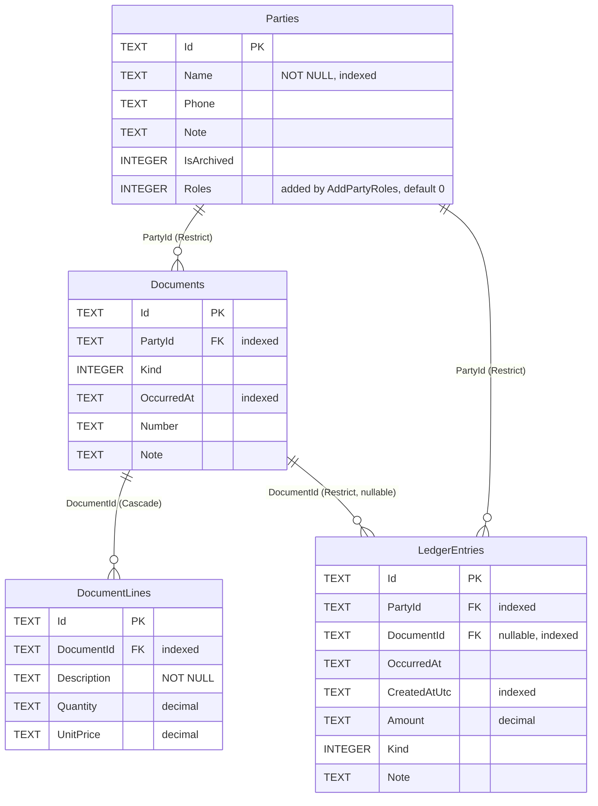
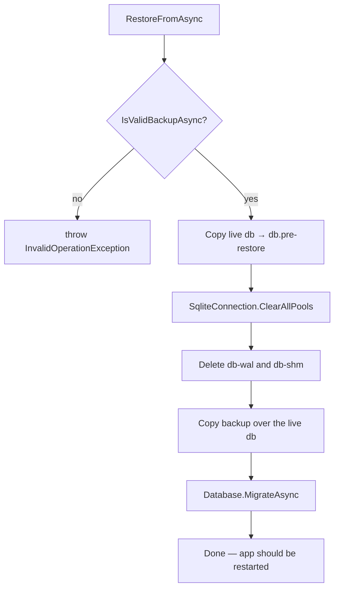

# 03 — Data Layer (`Oab.Data`)

[← 02 Money Engine](02-money-engine.md) · [Index](README.md) · Next: [04 — App Shell](04-app-shell.md)

---

`Oab.Data` maps the money engine onto a single SQLite file living in the app's
private storage. It references `Oab.Core` and nothing from MAUI, which is why the
whole layer — including migrations and backup/restore — is tested on a Linux CI
runner.

```
src/Oab.Data/
├── OabDbContext.cs                      EF model + mapping
├── LedgerStore.cs                       ILedgerStore over SQLite
├── OabDataServiceCollectionExtensions.cs AddOabData(path)
├── DesignTimeDbContextFactory.cs        for `dotnet ef` only
├── Backup/
│   ├── IDatabaseBackup.cs               contract + OabDatabase(path) record
│   └── DatabaseBackupService.cs         VACUUM INTO, validate, restore
└── Migrations/
    ├── 20260708102734_InitialCreate.cs
    ├── 20260722003555_AddPartyRoles.cs
    └── OabDbContextModelSnapshot.cs
```

| Package | Version | Why |
|---|---|---|
| `Microsoft.EntityFrameworkCore.Sqlite` | 10.0.9 | The provider |
| `Microsoft.EntityFrameworkCore.Design` | 10.0.9 | `PrivateAssets=all` — tooling only, not shipped |
| `SQLitePCLRaw.bundle_e_sqlite3` | 3.0.3 | The native SQLite bundle for Android |

---

## 1. Schema



### Indexes

| Table | Column | Serves |
|---|---|---|
| `Parties` | `Name` | Alphabetical list ordering |
| `Documents` | `PartyId` | Per-party document lookup |
| `Documents` | `OccurredAt` | Date-range filtering. It no longer serves the purchases list's ordering — see §4 |
| `DocumentLines` | `DocumentId` | Loading a document's lines |
| `LedgerEntries` | `PartyId` | Balances and statements |
| `LedgerEntries` | `DocumentId` | "Is this invoice paid?" |
| `LedgerEntries` | `CreatedAtUtc` | Append order; the basis for future sync |

### Delete behaviour

| Relationship | Behaviour | Reasoning |
|---|---|---|
| `Document` → `Party` | **Restrict** | A party with history cannot be deleted out from under it. Archive instead. |
| `LedgerEntry` → `Party` | **Restrict** | Same — the ledger must stay complete. |
| `LedgerEntry` → `Document` | **Restrict** | An invoice with money attached cannot vanish. |
| `DocumentLine` → `Document` | **Cascade** | Lines are descriptive detail owned entirely by their document; they carry no money. |

Cascade appears exactly once, on the only relationship where the child has no
independent meaning.

## 2. `OabDbContext` — [`OabDbContext.cs`](../src/Oab.Data/OabDbContext.cs)

A primary-constructor `DbContext` with four `DbSet`s. All mapping is in
`OnModelCreating`; there are **no data-annotation attributes on the domain
entities**, which is what keeps `Oab.Core` free of any persistence concern.

Notable mapping decisions:

- `Party.Name` → `IsRequired()` + `HasIndex`.
- `Document.Lines` → `HasMany().WithOne()` with **no navigation property back to
  the document**. `DocumentLine` has a `DocumentId` and nothing else pointing
  upward, keeping the object graph a tree.
- `DocumentLine.Total` → `Ignore`d. It is a computed C# property; storing it
  would create a second source of truth for a multiplication.
- The FKs from `Document` and `LedgerEntry` to `Party` use
  `HasOne<Party>().WithMany()` — **shadow relationships with no navigation
  property on either side**. The domain model has no `Party.Entries` collection,
  so there is no way to accidentally lazy-load a party's whole history.

## 3. Why decimals are stored as TEXT

The migrations declare `Amount`, `Quantity`, and `UnitPrice` as
`table.Column<decimal>(type: "TEXT", ...)`. SQLite has no decimal type; its
`REAL` is an IEEE-754 double, and a double cannot represent `0.1` exactly.
Storing money as text preserves the decimal exactly on round-trip.

The cost is that SQLite cannot do arithmetic on those columns, which is why
`LedgerStore` sums in C# rather than in SQL (§4). The guarantee is pinned by a
test that would fail under any floating-point storage:

```csharp
// LedgerStoreSqliteTests.DecimalAmounts_SurviveRoundTrip_Exactly
await _service.RecordSaleAsync(party.Id, 0.1m, ...);
await _service.RecordSaleAsync(party.Id, 0.2m, ...);
Assert.Equal(0.3m, await _service.GetPartyBalanceAsync(party.Id));
```

`Guid` and `DateTimeOffset` are likewise stored as TEXT — EF Core's default for
SQLite. `DateTimeOffset` carries a second consequence that cost the product two
working screens: SQLite cannot **order** by one either, so both newest-first
reads sort in C# (§4).

## 4. `LedgerStore` — [`LedgerStore.cs`](../src/Oab.Data/LedgerStore.cs)

Implements `ILedgerStore` over `IDbContextFactory<OabDbContext>`. **A fresh
context per operation**, disposed with `await using`. That is what makes the
store safe to register as a singleton behind MAUI pages that come and go, and
avoids `DbContext`'s thread-affinity entirely.

Every read uses `AsNoTracking()` — nothing in the app mutates a loaded entity.

| Method | Implementation notes |
|---|---|
| `AddPartyAsync` | Simple insert. |
| `UpdatePartyAsync` | `db.Parties.Update` + save. **Still no caller in the app** — but no longer untested; see the note below. |
| `GetPartyAsync` | By id, no tracking. |
| `GetPartiesAsync` | `WHERE includeArchived OR NOT IsArchived`, `ORDER BY Name`, **then role filtering in memory**. |
| `AddDocumentAsync` | Inserts the document with its lines in one save. |
| `GetDocumentAsync` | `Include(d => d.Lines)`. |
| `GetDocumentsAsync` | Optional `kind` / `partyId` filters and `Include(Lines)` in SQL, then **ordered newest-first in C#**. |
| `AddEntriesAsync` | `AddRange` + one `SaveChangesAsync` — both entries of a cash purchase land in a single transaction. |
| `GetEntriesForPartyAsync` | `WHERE PartyId = …`, then **ordered newest-first in C#**. (Consumers that need a running balance re-sort ascending themselves — see [04 §10](04-app-shell.md#10-party-statement--shared-detail-screen).) |
| `GetEntriesForDocumentAsync` | Unordered — callers only sum. |
| `GetEntriesForDocumentsAsync` | The same question for many invoices at once, keyed by document id. One `IN` query; see §4.2. Documents with nothing against them are absent, so callers use `GetValueOrDefault(id, [])`. |
| `GetPartyBalanceAsync` | `SELECT Amount WHERE PartyId = …` then `.Sum()` **in C#**. |
| `GetBalancesAsync` | `SELECT PartyId, Amount` for the whole table, then `GroupBy`/`Sum` in C#. Returns a dictionary; parties with no entries are simply absent, so callers use `GetValueOrDefault`. |

> **`UpdatePartyAsync` will not create a party.** EF's `Update` on an entity the
> database has never seen is an `UPDATE` matching no rows, which surfaces as a
> `DbUpdateConcurrencyException` rather than an insert. That matters for the
> party-editing screen that does not exist yet: it must call `AddPartyAsync` for
> new parties and this only for existing ones. Pinned by
> `PartyEditingSqliteTests.Updating_APartyThatWasNeverAdded_Throws_RatherThanInsertingIt`.

### Client-side evaluation, and why

Four reads finish their work in C# rather than in SQL. All are commented in the
source, and all are correct *for this product's data sizes* — a shop has tens to
hundreds of parties, not millions.

| Read | Done in C# | Why |
|---|---|---|
| `GetPartiesAsync` role filter | filtering | `PartyRole` is a `[Flags]` enum whose matching rule includes "`None` matches everything" (D3). SQLite cannot translate that predicate. |
| `GetPartyBalanceAsync`, `GetBalancesAsync` | summing | Amounts are TEXT (§3), so `SUM()` in SQL would be meaningless. |
| `GetDocumentsAsync` | ordering | **SQLite has no `DateTimeOffset`.** |
| `GetEntriesForPartyAsync` | ordering | Same. |

The first two are design choices. **The last two are not** — they are a
correctness fix.

> `ORDER BY` on a `DateTimeOffset` is not silently evaluated client-side by EF
> Core; it is **rejected at query-translation time** with
> `NotSupportedException: SQLite does not support expressions of type
> 'DateTimeOffset' in ORDER BY clauses`.
>
> Both methods used to sort in SQL, which meant the purchases list and the party
> statement threw on **every single open**. Nothing caught it: no test in this
> suite called either method, and the view-model tests use `InMemoryLedgerStore`,
> which sorts in C# and cannot fail this way. It surfaced within 25 seconds of
> the global exception handler being installed
> ([04 §9](04-app-shell.md#what-it-found-immediately)).
>
> Now pinned by `Documents_ComeBackNewestFirst`,
> `PartyEntries_ComeBackNewestFirst`, and `OccurredAt_KeepsItsUtcOffset_AcrossStorage`.

Sorting after the fact is cheap here because the `WHERE` still runs server-side:
`GetDocumentsAsync` sorts one shop's purchases and `GetEntriesForPartyAsync` sorts
one party's entries — not the table. The `Documents.OccurredAt` index no longer
serves the ordering, but it still serves the filter.

`GetBalancesAsync` reading the entire `LedgerEntries` table is the one that will
need attention first at scale; see
[10 — Status §4](10-status.md#4-known-gaps-and-risks).

### 4.2 Asking about many invoices at once

`GetEntriesForDocumentsAsync` exists because the purchases list needs *"is each
of these invoices paid?"* for every row on screen, and the obvious way to get
that — call `GetEntriesForDocumentAsync` inside the loop — is one round trip per
row. Fine at ten purchases; 2,000 round trips at two thousand, on every
`OnAppearing`, on a cheap phone. It is the same shape as `GetBalancesAsync`: one
query, grouped in memory, keyed by id.

The one non-obvious line is `EF.Parameter`:

```csharp
.Where(e => e.DocumentId.HasValue && EF.Parameter(ids).Contains(e.DocumentId.Value))
```

Written as a plain `ids.Contains(...)`, EF Core emits **one SQL parameter per
id**:

```sql
WHERE "DocumentId" IS NOT NULL AND "DocumentId" IN (@ids1, @ids2, @ids3)
```

That is a ceiling with a growing shop pointed at it — SQLite's historical
variable limit is 999. `EF.Parameter` forces the collection to travel as a single
JSON parameter, expanded server-side:

```sql
WHERE "DocumentId" IS NOT NULL AND "DocumentId" IN (SELECT "value" FROM json_each(@ids))
```

One parameter, any number of invoices. Both shapes above were read off the
generated SQL rather than assumed — the plain form's translation was a surprise,
and the first version of this method shipped a comment claiming the opposite.
Pinned by
`DocumentLookupSqliteTests.BatchedEntries_HandleMoreDocumentsThanSqliteAllowsParameters`,
which seeds 1,500 documents specifically to be past the old limit, and by
`BatchedEntries_MatchAskingOneDocumentAtATime`, which is the assertion that makes
it a safe replacement rather than a faster wrong answer.

## 5. Registration — [`OabDataServiceCollectionExtensions.cs`](../src/Oab.Data/OabDataServiceCollectionExtensions.cs)

```csharp
services.AddOabData(databasePath);
```

Registers, in order: the `DbContextFactory` pointed at
`Data Source={databasePath}`, `ILedgerStore → LedgerStore` (singleton),
`LedgerService` (singleton), an `OabDatabase(databasePath)` record so the backup
service knows which file is live, and `IDatabaseBackup → DatabaseBackupService`.

The path is supplied by `UseOab` as
`Path.Combine(FileSystem.AppDataDirectory, config.DatabaseFileName)` — the
app's private directory, which on Android is not readable by other apps and is
included in the platform's own app-data backup if enabled.

## 6. Migrations

| Migration | Date | Change |
|---|---|---|
| `20260708102734_InitialCreate` | 2026-07-08 | All four tables, all FKs, all indexes |
| `20260722003555_AddPartyRoles` | 2026-07-22 | `Parties.Roles INTEGER NOT NULL DEFAULT 0` |

`AddPartyRoles` is the migration that proves the upgrade story: it adds a
column with default `0` (= `PartyRole.None`), and `None` matches every list
filter, so an existing shop's parties keep appearing exactly where they did
before the column existed. No data migration, no backfill, no lost rows.

`Database.Migrate()` runs in the `OabApp` constructor
([01 §4](01-architecture.md#4-startup-sequence)) and again at the end of a
restore (§7), so both a fresh install and an older backup arrive at the current
schema.

### Adding a migration

```bash
dotnet ef migrations add <Name> --project src/Oab.Data
```

[`DesignTimeDbContextFactory`](../src/Oab.Data/DesignTimeDbContextFactory.cs)
exists solely so this command works without an app head: it hands EF a context
pointed at `design-time.db`, a file that is never created at runtime.

Workflow: edit entities in `Oab.Core` → adjust mapping in `OabDbContext` → run
the command → **read the generated `Up()`** and confirm existing rows survive.

## 7. Backup and restore

Files: [`IDatabaseBackup.cs`](../src/Oab.Data/Backup/IDatabaseBackup.cs),
[`DatabaseBackupService.cs`](../src/Oab.Data/Backup/DatabaseBackupService.cs).

> This is the single most important safety feature in the product. Without it, a
> lost or broken phone loses the entire ledger — worse than the paper notebook
> being replaced.

### `CreateSnapshotAsync(destinationPath)`

1. Delete `destinationPath` if it exists — `VACUUM INTO` refuses to overwrite.
2. Create the destination directory if needed.
3. `VACUUM INTO '<path>'`.

`VACUUM INTO` is used rather than `File.Copy` because it produces a
**consistent, defragmented copy while the app still holds the database open**.
A raw file copy can catch a half-written page or miss the journal, producing a
backup that is silently corrupt — the worst possible failure mode for this
feature. The destination path is single-quote-escaped before interpolation:
`VACUUM INTO` cannot take a parameter, so there is no `ExecuteSqlAsync` form of
it. The resulting `EF1002` is suppressed at that one statement with a `#pragma`
and the reasoning inline — a warning printed on every build is how a real one
gets skipped.

### `IsValidBackupAsync(candidatePath)`

Guards restore against a user picking a photo, a half-downloaded file, or
another app's database.

1. File must exist.
2. Open it **read-only** as SQLite (`SqliteOpenMode.ReadOnly`) — a valid check
   never modifies the candidate.
3. Query `sqlite_master` for all four required tables: `Parties`, `Documents`,
   `DocumentLines`, `LedgerEntries`. The table name is passed as a **parameter**,
   not concatenated.
4. Any `SqliteException` → `false`. Not a SQLite file, or corrupt — either way,
   not a backup.

### `RestoreFromAsync(backupPath)`



Each step earns its place:

- **`.pre-restore` copy** — never destroy the current book without keeping a
  copy. If the user restores the wrong file, yesterday's data is still on disk.
- **`ClearAllPools`** — releases pooled connection handles so the file can be
  replaced on Windows and so no stale handle writes to it afterwards.
- **Deleting `-wal` and `-shm`** — those sidecar files belong to the *old*
  database. Left in place next to a restored file they would corrupt it.
- **`MigrateAsync` at the end** — the backup may predate the current schema. A
  book exported from v1 restores cleanly into v2.

The app cannot hot-swap its open connections, so the UI tells the user to close
and reopen (`Backup_RestoreDone`).

## 8. Test coverage

[`tests/Oab.Data.Tests`](../tests/Oab.Data.Tests) — **40 tests, all passing.**
Every one runs against a **real SQLite file in the temp directory with the real
migrations applied**; there is no in-memory EF provider anywhere in this suite,
because an in-memory provider would not have caught the decimal-storage issue or
the WAL-sidecar issue.

| File | Covers |
|---|---|
| [`SqliteTestDatabase`](../tests/Oab.Data.Tests/SqliteTestDatabase.cs) | Not a test — the harness. A temp directory, a migrated database file, a `LedgerStore` and a `LedgerService` over it, `ReopenStore()` for restart simulation, and pool-clearing disposal. One copy of what used to be three. |
| `LedgerStoreSqliteTests` | Full purchase→payment flow persisted and balanced; exact decimal round-trip; archived parties hidden by default; **documents and party entries come back newest-first** and `OccurredAt` keeps its UTC offset; **data survives reopening the file** (simulated app restart) |
| `PartyEditingSqliteTests` | Name/phone/note round-trip through a detached entity; no duplicate row; `[Flags]` roles surviving an edit; **archiving hides the party and keeps the balance and history**; un-archiving; edits surviving a restart; `Update` on an unknown party throwing rather than inserting |
| `DocumentLookupSqliteTests` | A document coming back with every line, exact decimal quantities and prices, its `Number`/`Note`/offset, empty-not-null lines, an unknown id being `null`, and lines not leaking between invoices. Then the entries side: outstanding falling as payments land; **standalone payments and other invoices ignored**; **a correction moving the invoice's remainder, not just the party balance**; correcting to zero; a cash purchase settled on arrival; and the batched read (§4.2) agreeing with the one-at-a-time read, omitting empty documents, and surviving 1,500 ids |
| `PartyRoleFilterTests` | Supplier/customer separation; a party with both roles appearing in both lists; the legacy `None`-shows-everywhere rule |
| `DatabaseBackupTests` | Snapshot → damage → restore recovers the exact book; `.pre-restore` copy exists and is itself valid; snapshot overwrites a stale file; a junk file is rejected and restore refuses it; a missing file is rejected; **a real but foreign SQLite database is rejected** |

The three ordering tests were added *after* the bug they describe reached a
running app. The lesson is narrower than "write more tests": **a store method
with no test against real SQLite is a store method that has never run** — the
in-memory fake will happily pass anything the LINQ provider would reject.

`PartyEditingSqliteTests` and `DocumentLookupSqliteTests` are that rule being
paid off rather than re-learned: `UpdatePartyAsync`, `GetDocumentAsync`, and
`GetEntriesForDocumentAsync` were the three methods still matching its
description. **All three turned out to work.** That is worth stating plainly —
the rule earns its keep by making the check cheap, not by being right every time,
and a rule that only ever finds bugs would be a rule nobody could trust when it
came back clean.

`DatabaseBackupTests.Snapshot_ThenRestore_PreservesTheWholeBook` is the test
that encodes the product promise: record 250 on credit and a 100 payment, take a
backup, then record a further 999 (the "disaster"), restore, and assert the
balance is back to −150 with exactly one party.

---

Next: [04 — App Shell](04-app-shell.md)
