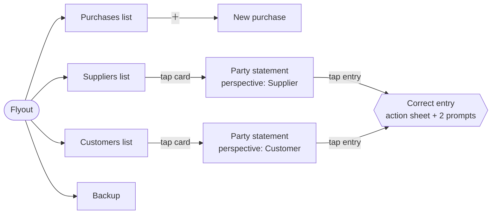

# 05 — Feature Modules

[← 04 App Shell](04-app-shell.md) · [Index](README.md) · Next: [06 — Localization & RTL](06-localization.md)

---

A module is a self-contained feature a shop can have or not have. Four exist
today. Each is a MAUI class library targeting `net10.0-android` and
`net10.0-windows10.0.19041.0`, referencing **only `Oab.App`**.

| Module | Nav key | Route | Screens | Ships by default |
|---|---|---|---|---|
| [Purchases](#1-purchases) | `Purchases_Title` | `purchases` | Purchases list, New purchase | yes |
| [SupplierDebts](#2-supplierdebts) | `Suppliers_Title` | `suppliers` | Suppliers list | yes |
| [CustomerDebts](#3-customerdebts) | `Customers_Title` | `customers` | Customers list | yes |
| [Backup](#4-backup) | `Backup_Title` | `backup` | Backup | **always — see §5** |

Plus one screen that is **not** a module: the [party
statement](04-app-shell.md#10-party-statement--shared-detail-screen), which lives
in `Oab.App` because both list modules push it.

### Screen map



The correction flow is not a screen — it is dialogs over the statement page
([04 §10](04-app-shell.md#the-correction-flow)) — but it is the only place in the
product where an existing number can be changed, so it belongs on this map.

---

## 1. Purchases

`src/Oab.Modules/Oab.Modules.Purchases/` — *"log what I bought and whether it's
paid."* With SupplierDebts this alone is a sellable v1 for the
notebook-and-pen use case.

**Registration** ([`PurchasesModule.cs`](../src/Oab.Modules/Oab.Modules.Purchases/PurchasesModule.cs))

```csharp
services.AddTransient<PurchasesListViewModel>();
services.AddTransient<NewPurchaseViewModel>();
services.AddTransient<NewPurchasePage>();     // pushed, so not covered by a nav item
yield return new OabNavItem("Purchases_Title", "purchases", typeof(PurchasesListPage));
```

`PurchasesListPage` is registered automatically by `UseOab` because it is named
in a nav item; `NewPurchasePage` is pushed from code, so the module registers it
itself.

### Purchases list

`PurchasesListPage.xaml` + `PurchasesListViewModel.cs`

A `CollectionView` of cards, plus a circular `＋` floating button (with
`SemanticProperties.Description` for screen readers) that pushes the new-purchase
page.

**`PurchaseRow`** — supplier name, total, date, status text and colour, whether
unpaid, and the outstanding amount.

`LoadAsync`:

1. `GetDocumentsAsync(DocumentKind.Purchase)` — already ordered newest first by
   the store.
2. `GetPartiesAsync(includeArchived: true)` into a `Guid → Name` dictionary, so
   an archived supplier's old purchases still show a name rather than `?`.
3. For each document, fetch its entries and compute:
   - `total` = |sum of the `Purchase`-kind entries| — the invoice amount, which
     stays correct however many payments were made against it;
   - `outstanding` = `LedgerMath.Outstanding(entries)`;
   - status = `"Remaining: <amount>"` in Firebrick when unpaid, `"Paid"` in
     SeaGreen when settled.

**`PayRemainingCommand`** (a `[RelayCommand]`) posts
`RecordPaymentOutAsync(partyId, outstanding, DateTimeOffset.Now, documentId)` and
reloads. The button is bound via `Source={x:Reference ThisPage}` because the
command lives on the page's view model, not on the row.

> ⚠️ `LoadAsync` calls `GetEntriesForDocumentAsync` **once per document inside
> the loop** — an N+1 query. Fine at 10 purchases, painful at 2,000. See
> [10 §4](10-status.md#4-known-gaps-and-risks).

### New purchase

`NewPurchasePage.xaml` + `NewPurchaseViewModel.cs`

A scrolling form: supplier `Picker`, an `Entry` to type a *new* supplier name
instead, numeric amount, "Paid now" `Switch`, `DatePicker`, note, an error label,
and Save.

`LoadAsync` fills the picker with `GetPartiesAsync(role: PartyRole.Supplier)`
(which, per the role rule, also includes untagged legacy parties).

`SaveCommand` validation order:

1. Parse the amount; if it fails or is ≤ 0 → `Common_InvalidAmount`, **stop
   before creating anything**.
2. If a new supplier name was typed, create that `Party` with
   `Roles = PartyRole.Supplier`. The typed name wins over the picker selection.
3. If there is still no supplier → `Purchases_SelectSupplier`.
4. Build `occurredAt` from the picked **date** plus the current **time of day**,
   with the local UTC offset — so entries logged the same day still sort in the
   order they were entered.
5. `RecordPurchaseAsync(supplierId, amount, PaidNow, occurredAt, note?)`.
6. `PopAsync`.

Validating the amount *first* is what makes
`NewPurchase_InvalidAmount_SetsError_AndCreatesNoParty` pass — a bad amount never
leaves an orphan supplier behind.

`TryParseAmount` tries `CultureInfo.CurrentCulture` then `InvariantCulture`.
**It does not handle Arabic-Indic digits** — the app renders `٥٠` but cannot read
it back. See [10 §4](10-status.md#4-known-gaps-and-risks).

---

## 2. SupplierDebts

`src/Oab.Modules/Oab.Modules.SupplierDebts/` — *"who do I owe, and how much?"*

**Registration:** `SuppliersViewModel` (transient) + one nav item.
`SuppliersPage` is registered by `UseOab` via the nav item.

### Suppliers list

**`SupplierRow`** — the `Party`, balance text, balance colour, and `HasDebt`.

`LoadAsync` reads `GetPartiesAsync(role: PartyRole.Supplier)` and
`GetBalancesAsync()` (one query for all balances, not one per party), then:

| Balance | Text | Colour | `HasDebt` |
|---|---|---|---|
| `< 0` (shop owes) | `Suppliers_YouOwe` + amount | Firebrick | `true` |
| `> 0` (they owe) | `Suppliers_TheyOwe` + amount | SeaGreen | `false` |
| `= 0` | `Suppliers_Settled` | Gray | `false` |

**Interactions**

| Gesture | Effect |
|---|---|
| Tap a card | `PartyStatementPage.PushAsync(..., PartyRole.Supplier)` |
| `＋` button | `DisplayPromptAsync` for a name → `AddSupplierAsync` → new `Party { Roles = Supplier }` |
| "Record payment" (visible only when `HasDebt`) | Numeric prompt → `RecordPaymentOutAsync(partyId, amount, now)` — **no document id**, so it settles the party's overall balance |

Prompt text comes from `LocalizationManager.Current`, since a dialog has no
binding context. Amounts typed into prompts are parsed with the same
current-then-invariant fallback and rejected with a localized alert.

Both mutating methods refuse non-positive amounts and blank names, then reload.

---

## 3. CustomerDebts

`src/Oab.Modules/Oab.Modules.CustomerDebts/` — the mirror image: *"who owes me?"*

**`CustomerRow`** — the `Party`, balance text and colour, and `OwesYou`.

| Balance | Text | Colour | `OwesYou` |
|---|---|---|---|
| `> 0` (they owe) | `Customers_OwesYou` + amount | **Firebrick** | `true` |
| `< 0` (shop owes) | `Customers_YouOwe` + amount | SeaGreen | `false` |
| `= 0` | `Customers_Settled` | Gray | `false` |

Note the inversion against SupplierDebts: red means "an open debt in the
direction this screen is about" in both, which is exactly the reasoning the
statement page's `perspective` parameter encodes.

**Interactions**

| Gesture | Effect |
|---|---|
| Tap a card | `PartyStatementPage.PushAsync(..., PartyRole.Customer)` |
| `＋` | Name prompt → new `Party { Roles = Customer }` |
| "Record debt" (always visible) | Amount prompt → `RecordSaleAsync(partyId, amount, paidNow: false, now)` — goods taken on credit |
| "Collect payment" (only when `OwesYou`) | Amount prompt → `RecordPaymentInAsync(partyId, amount, now)` |

"Record debt" posts a **sale on credit**, not a bespoke "debt" concept — which is
why a customer's tab and a proper sale produce identical, mergeable history.

The code-behind factors amount parsing into a shared `ApplyAmountAsync(text,
action)` helper used by both prompts.

---

## 4. Backup

`src/Oab.Modules/Oab.Modules.Backup/` — getting the book off the phone and back
on again.

> Two kinds of copy, because they fail differently: the `.db` snapshot restores
> perfectly but only into this app; the text summary can be read by a human on
> any phone even if the app is gone entirely.

### The page

Four cards over an activity indicator and a status label:

| Card | Action |
|---|---|
| **Send backup file** | `CreateDatabaseSnapshotAsync()` → `Share.Default.RequestAsync(ShareFileRequest)` — the Android share sheet, so WhatsApp-to-self or Drive both work |
| **Send readable summary** | `CreateSummaryFileAsync()` → same share sheet |
| **Restore from a backup** (styled red on a red-tinted card) | confirm → file picker → validate → restore |
| **Send error report** (amber, and **hidden unless something has been logged**) | `CreateErrorLogFileAsync()` → same share sheet |

The error-report card lives here rather than on a settings screen because this is
the one screen a shopkeeper already understands as "send something out of the
app". It is bound to `HasErrorLog`: on a healthy phone the offer is noise, and a
button whose purpose the shopkeeper cannot guess is a button that makes the app
feel broken. Full reasoning in
[04 §9](04-app-shell.md#getting-the-log-off-the-phone).

### `BackupViewModel`

| Member | Behaviour |
|---|---|
| `CreateDatabaseSnapshotAsync` | Writes `{stem}.db` into `FileSystem.CacheDirectory` via `IDatabaseBackup.CreateSnapshotAsync`, returns the path |
| `CreateSummaryFileAsync` | Writes `{stem}.txt`, **UTF-8 with BOM** (`new UTF8Encoding(true)`) so Arabic text opens correctly in Windows Notepad and most Android viewers |
| `BuildSummaryTextAsync` | Reads all parties (**including archived**) and all balances, builds `SummaryLine`s, supplies localized `SummaryLabels`, and calls `LedgerSummaryReport.Build` with the shop name, now, culture, currency symbol and digit setting |
| `CreateErrorLogFileAsync` | Copies `ErrorLog.ReadAll()` into `{stem}-errors.txt` in the cache, same encoding and naming as the summary. A **copy**, because the share target holds a handle while the app may still be appending — and because `errors.log` arriving in someone's WhatsApp says nothing about which shop or which day it came from |
| `HasErrorLog` / `Refresh()` | Whether anything has been logged. It is a file on disk, not observable state, so nothing tells the UI when it changes: the page calls `Refresh()` on appearing and after every action |
| `IsValidBackupAsync` / `RestoreAsync` | Thin pass-throughs to `IDatabaseBackup` |
| `FileStem()` | `{ShopName with invalid filename chars and spaces → '-'}-{yyyy-MM-dd-HHmm}` |

Archived parties are included in the summary deliberately: a backup is a record,
not a working list.

### Restore safety

The user must say yes **twice** — once to a warning dialog that spells out that
everything since the backup will be lost, and once by deliberately choosing the
file. The picked file is then validated (`IsValidBackupAsync`) before anything
is touched, and rejected with `Backup_RestoreInvalid` if it is not an OAB book.
On success the user is told to close and reopen the app.

### The `async void` funnel

This page's `RunAsync` was the original of the funnel that is now shared by every
page as `Page.RunSafelyAsync`
([04 §9](04-app-shell.md#runsafelyasync--the-page-level-funnel)). What is left
here is only what is specific to this screen:

```csharp
private async Task RunAsync(Func<Task> action, [CallerMemberName] string context = "")
{
    if (_viewModel.IsBusy) return;                  // every action here is slow
    _viewModel.IsBusy = true; _viewModel.Status = "";
    try
    {
        await this.RunSafelyAsync(action,
            onError: ex => _viewModel.Status = $"{Loc["Common_Error"]}: {ex.Message}",
            context: context);
    }
    finally { _viewModel.IsBusy = false; _viewModel.Refresh(); }
}
```

Three details:

- **The busy guard stays local** — it is about this page's slow operations, not
  about exceptions.
- **`onError` writes to the status label**, not an alert. An alert raised on top
  of a share sheet is a dialog nobody sees.
- **`context` is forwarded explicitly.** Without it, `[CallerMemberName]` inside
  `RunSafelyAsync` would resolve to `RunAsync` and every log record from this page
  would name the wrapper instead of the button that was pressed.

---

## 5. Why Backup is effectively mandatory

The book lives on one phone with no sync. A shop that ships without
`BackupModule` has an app that is *strictly worse than the paper notebook it
replaced*: paper survives a dead battery.

Ship it in every build. It is listed as optional only because the module system
has no concept of a required module.

---

## 6. Writing a new module

A per-shop custom feature goes in **that shop's customer folder**. If a second
shop wants it, move the project to `src/Oab.Modules/`. Never fork the repo.

**1. Create the project.** Copy an existing module's `.csproj` — it needs
`UseMaui`, `SingleProject`, the two target frameworks, the `Microsoft.Maui.Controls`
package reference at `$(MauiVersion)`, and a project reference to `Oab.App`.
Do not add package versions; they come from
[`Directory.Build.props`](../Directory.Build.props).

**2. Implement `IOabModule`.**

```csharp
public class CashDayModule : IOabModule
{
    public string Name => "CashDay";

    public void ConfigureServices(IServiceCollection services)
    {
        services.AddTransient<CashDayViewModel>();
        // ...plus any page you push yourself (pages named in nav items are
        //    registered for you by UseOab).
    }

    public IEnumerable<OabNavItem> GetNavItems() =>
        [new OabNavItem("CashDay_Title", "cashday", typeof(CashDayPage))];
}
```

**3. Follow the house conventions.** They are what make the modules feel like one
app:

- Depend on `ILedgerStore` for reads and `LedgerService` for writes. **Never
  construct a `LedgerEntry`.**
- Depend on `IMoneyFormatter`, never on `MoneyFormat` directly.
- Render text and colour in the view model into an immutable `required init` row
  type. No `IValueConverter`s.
- All display text goes through `{oab:Tr Key}` in XAML, or
  `LocalizationManager` in code-behind for dialogs. **No literal strings on
  screen.**
- Add every new key to **both** `Strings.resx` and `Strings.ar.resx`.
- Guard `LoadAsync` with an `IsBusy` check — `OnAppearing` can re-enter.
- **Run every `async void` handler and every `OnAppearing` override through
  `this.RunSafelyAsync(...)`** (`using Oab.App.Diagnostics;`). An unwrapped
  handler is a silent crash on a shopkeeper's phone, and there is no second
  chance to find out what it was. If the module has a `[RelayCommand]` that
  writes, wrap its body too — a faulted `AsyncRelayCommand` rethrows onto the
  sync context.
- Use `{AppThemeBinding Light=#F2F2F7, Dark=#2C2C2E}` for card backgrounds, a
  `Border` with `StrokeShape="RoundRectangle 12"`, `Margin="0,4"`, `Padding="14"`,
  and give the `CollectionView` an `EmptyView`.
- Put `SemanticProperties.Description` on icon-only buttons.

**4. Reference and register it** in the customer head's `.csproj` and pass an
instance to `UseOab`. Position in the argument list = position in the flyout.

**5. Test it.** Add a class to `tests/Oab.App.Tests` and use the `VmContext`
helper, which assembles the real dependency graph with only the database and
device preferences faked.

**6. If it adds an `ILedgerStore` method, test that against real SQLite too.**
`InMemoryLedgerStore` runs LINQ-to-Objects, so it will happily pass a query the
SQLite provider refuses to translate. That gap hid a `NotSupportedException` on
two shipped screens; see [03 §4](03-data-layer.md#client-side-evaluation-and-why).

---

Next: [06 — Localization & RTL](06-localization.md)
