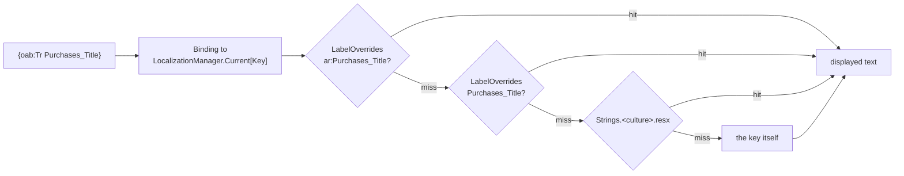

# 06 — Localization & RTL

[← 05 Feature Modules](05-modules.md) · [Index](README.md) · Next: [07 — Per-Shop Customization](07-customization.md)

---

Arabic is the **default** language and right-to-left is wired in from the first
screen. English is the second language, switchable live from the flyout footer.
Nothing about either is retrofitted, because RTL retrofits do not work.

## 1. How a string reaches the screen



Falling back to the key means a missing translation shows as
`Purchases_Title` on screen — ugly, and therefore noticed, rather than blank.

Mechanics are documented in [04 §6](04-app-shell.md#6-localization). The short
version:

- **In XAML:** `{oab:Tr SomeKey}` produces a live `Binding`, not a resolved
  string.
- **In code-behind** (dialogs have no binding context):
  `LocalizationManager.Current!["SomeKey"]`.
- **Switching:** `CycleCulture()` → `SetCulture()` → persist to `IPreferences`
  under `oab.culture` → raise `PropertyChanged("Item")`, which invalidates every
  indexer binding at once → the whole UI re-renders in the new language, plus
  `FlowDirection` flips. No restart.

Namespace declaration — note the `;assembly=` part, required in modules, omitted
inside `Oab.App` itself:

```xml
<!-- in a module -->
xmlns:oab="clr-namespace:Oab.App.Localization;assembly=Oab.App"
<!-- inside Oab.App -->
xmlns:oab="clr-namespace:Oab.App.Localization"
```

## 2. Right-to-left

`OabShell` **binds** `FlowDirection` to `LocalizationManager.FlowDirection`,
which is derived from `Culture.TextInfo.IsRightToLeft`. Because the shell is the
root, every page inherits it, and because it is a binding rather than an
assignment, the flip happens the instant the language changes.

`AndroidManifest.xml` sets `android:supportsRtl="true"`.

Layouts use `HorizontalOptions="End"`, `Grid` column definitions, and
`Margin`/`Padding` values that MAUI mirrors automatically under RTL. There are no
hardcoded left/right positions in any page.

> **Not yet verified on a physical Android phone in Arabic.** RTL layout, Arabic
> font rendering, the `ar` `DatePicker`, and the numeric keyboard are all
> Windows-verified only. See [10 §4](10-status.md#4-known-gaps-and-risks).

## 3. Numerals

`ShopConfig.UseArabicIndicDigits` switches rendered amounts from `0123` to
`٠١٢٣`, applied by `MoneyFormat.MapDigits` (see
[02 §6](02-money-engine.md#6-moneyformat--moneyformatcs)). It affects **money
output only** — dates use standard culture formatting, and the `Settled:` count
in the summary report is plain.

**Input is a known gap.** `NewPurchaseViewModel.TryParseAmount` tries
`CurrentCulture` then `InvariantCulture`; neither parses Arabic-Indic digits. A
shop with this option on renders `٥٠` but cannot read `٥٠` back. The same
two-culture attempt is copied in `SuppliersPage`, `CustomersPage`, and
`PartyStatementPage` — **four call sites for one missing function**, which is a
map-to-ASCII helper next to `MapDigits` in Core.

Because of this, `Correct_InvalidAmount` says **"أدخل صفرًا"** — the word — rather
than the digit `٠` it would naturally use. Instructing someone to type a
character the app cannot parse is worse than being slightly less idiomatic.
Revisit the wording once input is fixed.

## 4. Resource key catalogue

**81 keys, both languages complete.** Files:
[`Strings.resx`](../src/Oab.App/Resources/Strings.resx) (English, the neutral
fallback) and [`Strings.ar.resx`](../src/Oab.App/Resources/Strings.ar.resx).

### Common (13)

| Key | English | Arabic | Used by |
|---|---|---|---|
| `Common_Save` | Save | حفظ | New purchase; all prompts |
| `Common_Cancel` | Cancel | إلغاء | All prompts; restore confirm |
| `Common_OK` | OK | موافق | Error alerts |
| `Common_Amount` | Amount | المبلغ | New purchase |
| `Common_Note` | Note | ملاحظة | New purchase |
| `Common_Date` | Date | التاريخ | New purchase |
| `Common_Paid` | Paid | مدفوع | Purchases list status |
| `Common_Unpaid` | Unpaid | غير مدفوع | *unused* |
| `Common_Remaining` | Remaining | المتبقي | Purchases list status |
| `Common_Add` | Add | إضافة | *unused* |
| `Common_Language` | English / العربية | العربية / English | Flyout footer button |
| `Common_Error` | Something went wrong | حدث خطأ ما | Error alerts; backup status |
| `Common_InvalidAmount` | Enter a valid amount greater than zero | أدخل مبلغًا صحيحًا أكبر من صفر | All amount validation |

### Party (2)

| Key | English | Arabic | Used by |
|---|---|---|---|
| `Party_Name` | Name | الاسم | *unused* |
| `Party_Phone` | Phone | الهاتف | *unused* |

### Purchases (8)

| Key | English | Arabic | Used by |
|---|---|---|---|
| `Purchases_Title` | Purchases | المشتريات | Flyout, list page title |
| `Purchases_New` | New purchase | شراء جديد | Form title, `＋` accessibility label |
| `Purchases_Supplier` | Supplier | المورّد | Form |
| `Purchases_NewSupplierHint` | ...or type a new supplier name | ...أو اكتب اسم مورّد جديد | Form placeholder |
| `Purchases_PaidNow` | Paid now | مدفوع الآن | Form switch |
| `Purchases_Empty` | No purchases yet. Log the first one with the + button. | لا مشتريات بعد. سجّل أول شراء بزر + | List empty view |
| `Purchases_PayRemaining` | Pay remaining | دفع المتبقي | Row button |
| `Purchases_SelectSupplier` | Choose a supplier or type a new name | اختر مورّدًا أو اكتب اسمًا جديدًا | Form validation error |

### Suppliers (9)

| Key | English | Arabic | Used by |
|---|---|---|---|
| `Suppliers_Title` | Suppliers | الموردون | Flyout, page title |
| `Suppliers_YouOwe` | You owe | عليك | Row balance (negative) |
| `Suppliers_TheyOwe` | They owe you | لك عنده | Row balance (positive) |
| `Suppliers_Settled` | Settled | خالص | Row balance (zero) |
| `Suppliers_RecordPayment` | Record payment | تسجيل دفعة | Row button, prompt title |
| `Suppliers_PaymentPrompt` | How much did you pay? | كم دفعت؟ | Prompt body |
| `Suppliers_AddSupplier` | Add supplier | إضافة مورّد | `＋`, prompt title |
| `Suppliers_NamePrompt` | Supplier name | اسم المورّد | Prompt body |
| `Suppliers_Empty` | No suppliers yet. Add one with the + button. | لا موردين بعد. أضف واحدًا بزر + | Empty view |

### Customers (11)

| Key | English | Arabic | Used by |
|---|---|---|---|
| `Customers_Title` | Customers | الزبائن | Flyout, page title |
| `Customers_OwesYou` | Owes you | عليه | Row balance (positive) |
| `Customers_YouOwe` | You owe them | له عندك | Row balance (negative) |
| `Customers_Settled` | Settled | خالص | Row balance (zero) |
| `Customers_AddCustomer` | Add customer | إضافة زبون | `＋`, prompt title |
| `Customers_NamePrompt` | Customer name | اسم الزبون | Prompt body |
| `Customers_Empty` | No customers yet. Add one with the + button. | لا زبائن بعد. أضف واحدًا بزر + | Empty view |
| `Customers_RecordDebt` | Record debt | تسجيل دين | Row button, prompt title |
| `Customers_DebtPrompt` | How much did they take on credit? | كم أخذ بالدَّين؟ | Prompt body |
| `Customers_CollectPayment` | Collect payment | تحصيل دفعة | Row button, prompt title |
| `Customers_PaymentPrompt` | How much did they pay? | كم دفع؟ | Prompt body |

### Statement (10)

| Key | English | Arabic | Used by |
|---|---|---|---|
| `Statement_Title` | Statement | كشف الحساب | Page title |
| `Statement_Empty` | Nothing recorded with this person yet. | لا يوجد أي تسجيل مع هذا الشخص بعد. | Empty view |
| `Statement_YouOwe` | You owe them | عليك | Balance phrasing (negative) |
| `Statement_TheyOwe` | They owe you | لك | Balance phrasing (positive) |
| `Statement_Settled` | Settled | خالص | Balance phrasing (zero) |
| `Statement_KindPurchase` | Purchase | شراء | Row kind label |
| `Statement_KindSale` | Sale | بيع | Row kind label |
| `Statement_KindPaymentOut` | You paid | دفعتَ | Row kind label |
| `Statement_KindPaymentIn` | They paid | دفع لك | Row kind label |
| `Statement_KindAdjustment` | Correction | تصحيح | Row kind label |

### Correct (9)

The correction flow on the statement page
([04 §10](04-app-shell.md#the-correction-flow)). Its own area rather than more
`Statement_` keys, because a shop that rewords "Statement" has no reason to
reword the correction dialogs with it.

| Key | English | Arabic | Used by |
|---|---|---|---|
| `Correct_Title` | Correct entry | تصحيح القيد | Action sheet, both prompts, result alerts |
| `Correct_Action` | Correct this entry | صحّح هذا القيد | The one action-sheet option |
| `Correct_Recorded` | recorded as | المسجَّل | Amount prompt body — what the entry says now |
| `Correct_AmountPrompt` | What should the amount have been? | كم كان يجب أن يكون المبلغ؟ | Amount prompt body |
| `Correct_NotePrompt` | Why? This is saved with the correction. | ما السبب؟ يُحفظ مع التصحيح. | Reason prompt body |
| `Correct_Was` | Was | كان | Pre-filled reason — `"Was 1,000.00 SP"` |
| `Correct_InvalidAmount` | Enter the amount it should have been. Enter 0 if this entry should not be there at all. | أدخل المبلغ الصحيح. أدخل صفرًا إذا كان هذا القيد لا يجب أن يكون موجودًا أصلًا. | Unparseable or negative |
| `Correct_NoteRequired` | A correction has to say why. | لا بدّ من ذكر سبب التصحيح. | Reason cleared |
| `Correct_Unchanged` | That is already the amount recorded. Nothing was changed. | هذا هو المبلغ المسجَّل أصلًا. لم يتغيّر شيء. | Delta would be zero |

`Correct_InvalidAmount` deliberately does **not** reuse `Common_InvalidAmount`
("greater than zero"): here zero is a valid answer, and it means "this entry
should not exist". The message says so, because a shopkeeper who logged the same
purchase twice will look for exactly that.

`Correct_Was` is a prefix rather than a `{0}` format string. Placeholders are the
thing translators get wrong, and the concatenation reads correctly in both
directions because the amount is rendered by `IMoneyFormatter`.

### Backup (19)

| Key | English | Arabic | Used by |
|---|---|---|---|
| `Backup_Title` | Backup | النسخ الاحتياطي | Flyout, page title, alerts |
| `Backup_Explain` | Your book lives only on this phone… | دفترك محفوظ على هذا الهاتف فقط… | Page intro |
| `Backup_ShareDatabase` | Send backup file | إرسال ملف النسخة | Card title + button |
| `Backup_ShareDatabaseHint` | A full copy that can be restored… | نسخة كاملة يمكن استعادتها… | Card hint |
| `Backup_ShareSummary` | Send readable summary | إرسال ملخّص مقروء | Card title + button |
| `Backup_ShareSummaryHint` | A plain list of who owes what… | قائمة بسيطة بمن له ومن عليه… | Card hint |
| `Backup_Restore` | Restore from a backup | استعادة من نسخة | Card title, button, picker title |
| `Backup_RestoreHint` | Use this only on a new phone… | استعمل هذا فقط على هاتف جديد… | Card hint |
| `Backup_RestoreWarning` | This replaces everything currently in the app… | سيستبدل هذا كل ما في التطبيق حاليًا… | Confirmation dialog |
| `Backup_RestoreConfirm` | Yes, replace | نعم، استبدل | Confirmation accept |
| `Backup_RestoreInvalid` | That file is not a valid backup of this app. | هذا الملف ليس نسخة احتياطية صالحة لهذا التطبيق. | Validation failure |
| `Backup_RestoreDone` | Restored. Please close and reopen the app. | تمت الاستعادة. أغلق التطبيق ثم افتحه من جديد. | Success |
| `Backup_ShareTitle` | Shop backup | نسخة احتياطية للمحل | Share-sheet title |
| `Backup_ShareLog` | Send error report | إرسال تقرير الأخطاء | Error-log card title + button + share-sheet title |
| `Backup_ShareLogHint` | The app ran into a problem recently… | واجه التطبيق مشكلة مؤخرًا… | Error-log card hint |
| `Backup_YouOwe` | You owe | عليك | Summary report heading |
| `Backup_OwesYou` | Owed to you | لك | Summary report heading |
| `Backup_Settled` | Settled accounts | حسابات خالصة | Summary report line |
| `Backup_Total` | Total | الإجمالي | Summary report line |

**Four keys are currently unused** — `Common_Unpaid`, `Common_Add`,
`Party_Name`, `Party_Phone`. They were added for screens that do not exist yet (a
party editor, and an explicit "Unpaid" badge). Harmless, but worth knowing they
are not dead-by-accident.

### Naming convention

`<Area>_<Thing>`. Areas are `Common`, `Party`, and one per module or screen
(`Purchases`, `Suppliers`, `Customers`, `Statement`, `Correct`, `Backup`). Prompt bodies end
in `Prompt`, empty-state text in `Empty`, explanatory subtext in `Hint`.

## 5. Wording notes for the Arabic strings

The Arabic is written the way a shopkeeper speaks, not the way an accountant
writes:

- `عليك` — literally "on you", the ordinary way to say "you owe".
- `لك عنده` / `له عندك` — "you have with him" / "he has with you", the natural
  phrasing for a debt in either direction.
- `خالص` — "settled/paid up", the word actually used at a counter.

Direction is always carried by these **words**, never by a minus sign. A `−` in
front of a number in an RTL layout is ambiguous at a glance; `عليك` is not. This
is why [`MoneyFormat`](02-money-engine.md#6-moneyformat--moneyformatcs)
deliberately drops the sign.

## 6. Adding a language

1. Add `src/Oab.App/Resources/Strings.<culture>.resx` with all 81 keys. It is
   picked up automatically — `Oab.App.csproj` has no per-file resource item, and
   `ResourceManager` resolves satellite assemblies by culture.
2. Add the culture code to that shop's `ShopConfig.SupportedCultures`.
3. Update `Common_Language` in every `.resx` — it is the flyout button's label
   and should read sensibly in each language.
4. If the new language is RTL, nothing else is needed: `FlowDirection` follows
   `CultureInfo` automatically.

## 7. Adding a key

1. Add it to **both** `Strings.resx` and `Strings.ar.resx` (and any other
   language file). A key present in only one file silently falls back to the key
   name in the other.
2. Use it via `{oab:Tr NewKey}` or `LocalizationManager.Current!["NewKey"]`.
3. Never write a literal display string in XAML or code-behind.

## 8. Per-shop wording overrides

A shop can rename anything without a code change:

```csharp
LabelOverrides = new Dictionary<string, string>
{
    ["ar:Purchases_Title"] = "الدفتر",   // Arabic only
    ["Suppliers_Title"]    = "Wholesalers", // every language
}
```

Culture-prefixed keys use the **two-letter ISO language name**
(`Culture.TwoLetterISOLanguageName`), so `ar` — not `ar-SY`. Details and worked
examples in [07 — Per-Shop Customization](07-customization.md).

---

Next: [07 — Per-Shop Customization](07-customization.md)
